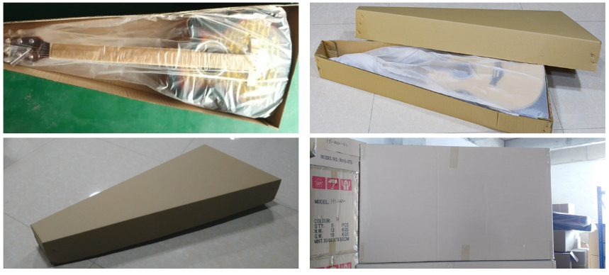
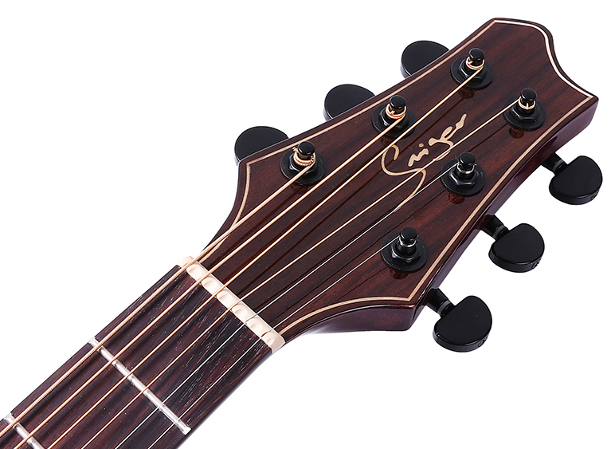
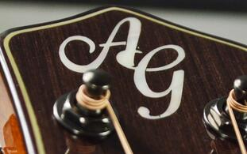
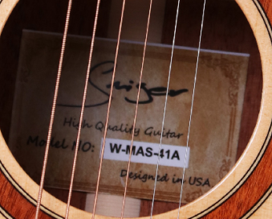
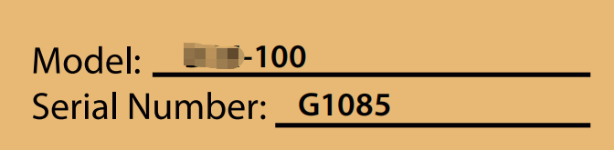
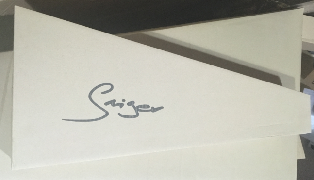
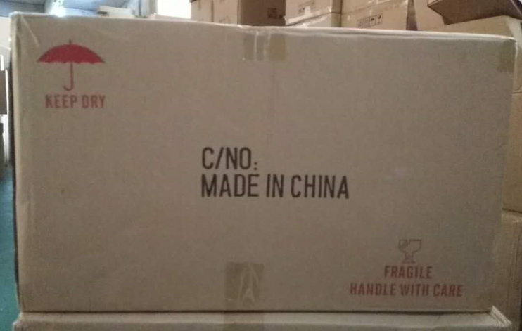

# 中高档民谣吉他 FAQ — Smiger (维音乐器)

> 原始文档：中高档民谣FAQ 191219.doc | 整理日期：2026-03-15

---

## 1. 价格 Price

**问：价格多少？ Price?**

答：

| 档次 Tier | 价格范围 Price Range (USD FOB) | 备注 Notes |
|-----------|-------------------------------|-----------|
| 入门级 Beginner | $16 – $35 | 不同尺寸 36"/40"/41"，多种木材、颜色和桶型供选择 |
| 中档 Mid-range | $43 – $62 | 可提供 EQ 安装服务，不同价位 EQ 供选择 |
| 高档 High-end | $43 – $215 | 面单/全单配置，高档木材和五金件 |

Our beginner guitar series price range from 16USD to 35USD. Different size includes 36"/40"/41". Various wood material/colors/body shapes for your options. Custom guitar pack with accessories service available. Equalizer installation available. Different price range EQ for your options.

---

## 2. 起订量 MOQ

**问：起订量多少？ What's the MOQ?**

答：

| 订单类型 Order Type | 最低起订量 MOQ | 混款规则 Mix Rules |
|--------------------|---------------|-------------------|
| 现货 Stock | 6 把（根据客户情况灵活报） | 可以混色混款 Mixed models/colors available |
| 贴牌 OEM/Custom brand | 120 把起订 | 可以混款；每个型号起订量 60 把，每个颜色起订量 30 把 |

> **注：** OEM 报价表首页的底价民谣 MOQ 是整柜，不可以混其他页面的常规款式。

Our brand stock MOQ 6PCS, mixed models/colors available. Custom brand MOQ 120pcs, mixed models available. Each model MOQ 60PCS. Each color MOQ 30PCS.

---

## 3. 交期 Delivery Time

**问：交期多久？ Delivery Time?**

答：

| 订单类型 | 交期 | 英文说明 |
|---------|------|---------|
| 现货单 Stock | 3–10 个工作日内发货 | Within 3-10 workdays depends on the exact order list |
| OEM 订单 | 支付定金和提供确认设计稿后的 **45–60 天** | Lead time is 45 to 60 days after receiving your deposit and confirmed design files |

---

## 4. 包装与装柜 Package & Container Capacity

**问：包装方式？一个 20/40 尺柜能装多少把？**

**Package? How many pcs of guitars can be fit to a full 1x20ft/40ft Container?**

### 常规包装实拍 Regular Packaging Photos

### 装柜容量表 Container Capacity Table

| 尺寸 Size | 每箱把数 PCS/CTN | 每箱体积 CBM/CTN | 20GP (28CBM) | 40GP (57CBM) | 40HQ (68CBM) |
|-----------|-----------------|-----------------|-------------|-------------|-------------|
| 36"       | 6               | 0.24            | 702         | 1,428       | 1,698       |
| 40"       | 6               | 0.25            | 672         | 1,368       | 1,632       |
| 41"       | 6               | 0.35            | 480 (58箱)  | 1,140       | 1,362       |
| 12弦吉他 12-string | 6     | 0.35            | 480         | 978         | 1,164       |
| 贝斯 Acoustic Bass | 4     | 0.27            | 416         | 844         | 1,128       |

---

## 5. 产品定制 Customization

### 5.1 LOGO 定制 Custom Logo

**问：可以定制 LOGO 吗？ Can I have my logo on guitar?**

答：可以，最低起订量是 120 把，可以混款，每个型号起订量 60 把。

Yes, custom logo service available. MOQ 120pcs, mixed models available. Each model MOQ 60PCS. Each color MOQ 30PCS.

#### LOGO 位置和材质 Logo Placement & Material

| 位置 Position | 默认工艺 Default Process | 说明 |
|--------------|------------------------|------|
| 琴头 Headstock | 单色水标 Single color decal | 可定制设计，需确认额外费用 |
| 内标 Sound hole label | 原木色打印纸张 Natural wood color printing paper | 可定制设计 |
| 内盒 Inner box | 黑色 LOGO | — |
| 外箱 Carton | 黑色 LOGO | — |

**琴头 LOGO 示例 Headstock Logo Examples：**

| Smiger 原厂琴头 | 客户定制 LOGO 示例（白贝镶嵌） |
|:---:|:---:|
|  |  |

**内标/音孔标签示例 Sound Hole Label Examples：**

| 标准内标 | 定制序号内标 |
|:---:|:---:|
|  |  |

**问：内标上可以做不同序号吗？ Can we custom different Serial Number inside tone hole?**

答：可以，每把不同序列号加价 **$0.5/把**。

Will add USD 0.5/pc if custom different serial number on the tag.

**包装展示 Packaging Examples：**

| 品牌包装盒 | 出货外箱 |
|:---:|:---:|
|  |  |

### 5.2 拾音器/EQ 安装 Pickup/EQ Installation

**问：可以安装拾音器/EQ 吗？ Can I have guitars with pickup/EQ?**

答：我们能提供安装 EQ 的服务。请从 EQ 价目表里选择你需要的 EQ，**EQ 安装费 10 元/把（约 $1.67 USD）**。

We can install pickups/EQ to guitar, please choose pickups from price list, install fee 1.67USD for each pickup.

### 5.3 套装定制 Custom Bundle Service

**问：可以做套装吗？ Can I order as a guitar bundle?**

答：我们可提供套装定制服务，配件可包括：

- 调音器 Tuner
- 背带 Strap
- 备用琴弦 Spare string set
- 拨片 Picks
- 背包或皮盒 Bag or hard case（高档吉他用）
- 变调夹 Capo

请从价目表里选择你要的款式。我们会根据要求打包。

We provide custom bundle service, please choose accessories from accessory price list. We will pack as your requirements.

### 5.4 配置更换费用表 Configuration Upgrade Surcharges

| 项目 Item | 加价 Surcharge (RMB) | 加价 Surcharge (USD) | 备注 Notes |
|-----------|---------------------|---------------------|-----------|
| 左手吉他 Left-handed | +3 元/把 | +$0.50/pc | — |
| 玫瑰木换科技木指板 Rosewood → Engineered wood | — | — | 不加钱 No extra charge |
| 亚克力块状音点 Acrylic block dots | +15 元/把 | — | — |
| ABS → 赛露露包边 Celluloid binding | +10 元/把 | — | 差价 |
| 白贝 LOGO Pearl shell logo | +12 元/把 | — | — |
| 枫木 LOGO 镶嵌 Maple inlay logo | +5 元/把 | — | — |
| 邮购包装 Mail-order packaging | +15 元/把 | — | — |
| EQ 安装费 EQ installation | +10 元/把 | +$1.67/pc | — |
| 内标不同序号 Custom serial number | — | +$0.50/pc | — |

### 5.5 彩盒加价表 Color Box Surcharge

> 彩盒 MOQ：**1,000 个** / Color box MOQ is 1,000PCS

| 尺寸 Size | 每把加价 Extra Cost/Guitar (USD) |
|-----------|-------------------------------|
| 34"       | $0.57                         |
| 36"       | $0.73                         |
| 38"       | $0.75                         |
| 39"       | $0.80                         |
| 40"       | $0.87                         |
| 41"       | $1.00                         |

---

## 6. 各国市场偏好 Country Preferences

| 国家 Country | 热销型号 Hot Models | 尺寸 Sizes | 其他要求 Special Requirements |
|-------------|-------------------|-----------|------------------------------|
| 🇳🇬 尼日利亚 Nigeria | LG-09, LG-07, SM-412/3, M-4160 | 40", 41" | N色, 装 EQ，配连接线，配包 |
| 🇺🇸 美国 USA | M-215-40, MAS-41A, MES-41A, MDS-41A, M-F1SS, SM-361/401 | 40", 41" | N色, 装 EQ（高档）, 内标每个不同序列号, 配包（高档加厚）, 红松面单, 指板不要镶嵌 |
| 🇨🇦 加拿大 Canada | SM-401-A/C | 40", 41" | — |
| 🇲🇲 缅甸 Myanmar | LG-07-09, EN/FN/GN, EN/FN-10/20/25/30, LG-09-EQ | 40" | N色, 擦色 Stained finish |
| 🇰🇭 柬埔寨 Cambodia | M-210-41, M-410-41 | 41" | — |

---

## 7. 客户好评 Customer Reviews

> 以下为历史客户反馈截图，展示 Smiger 产品在全球市场的实际评价。

*(原文档中此部分为客户好评截图区域，具体截图内容在原 .doc 文件中)*
